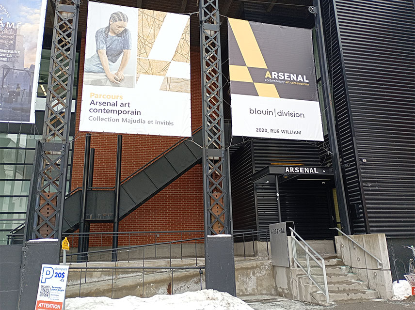
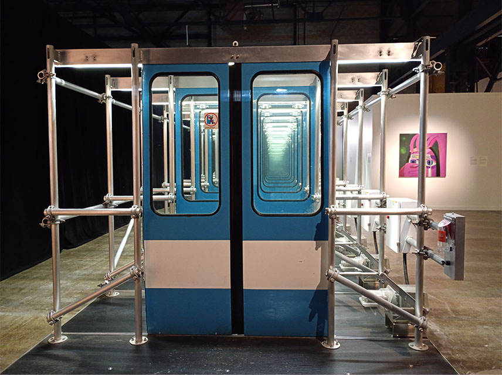
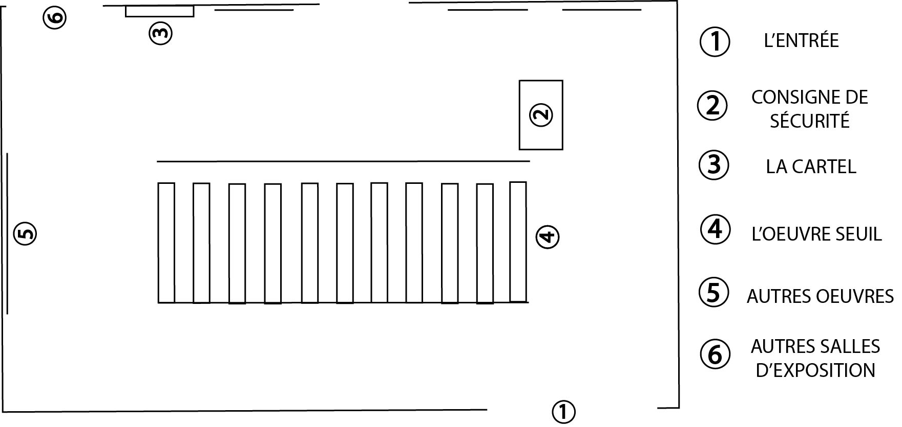
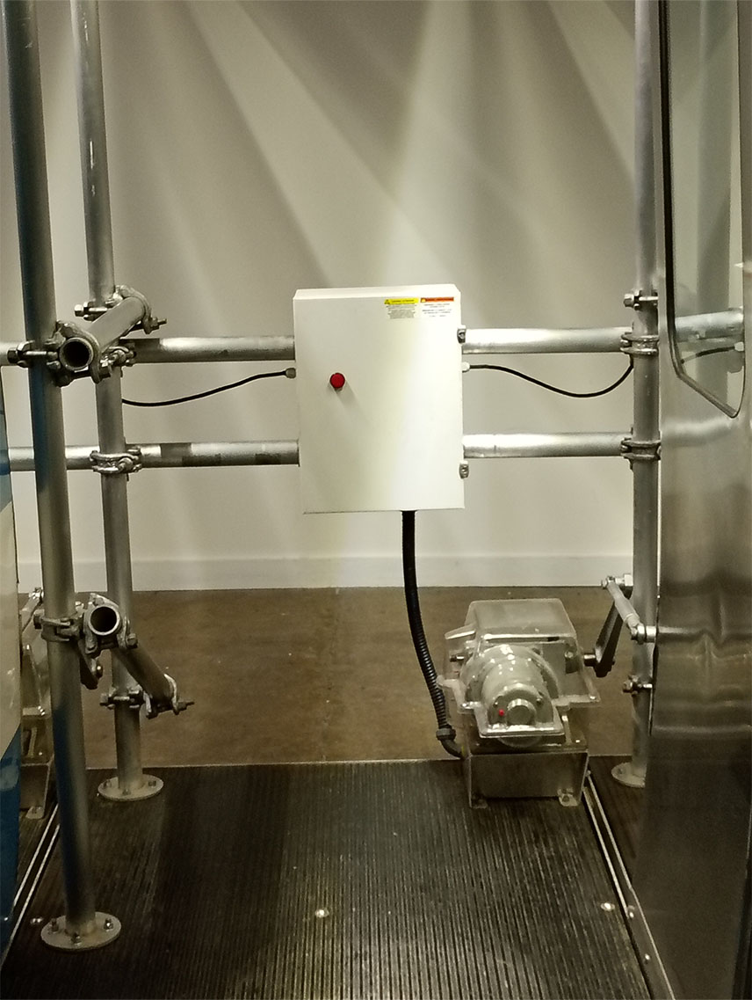
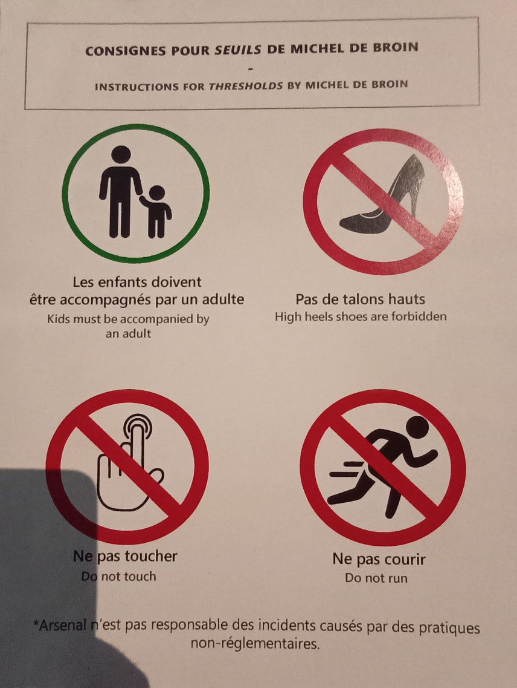

# Exposition Seuil de Michel de Broin

**Lieu :** Arsenal Art Contemporain  
**Type :** Exposition temporaire intérieure  
**Date de visite :** 20 février 2026  

> L'entrée du lieu d'exposition
---

## L'œuvre *Seuil*  

L'œuvre est une installation contemplative et interactive réalisée en 2017 par l'artiste Michel de Broin.
Elle est construite à partir d’anciennes portes de métro issues de l’Expo 67 et de détecteurs de mouvement. L’artiste y combine deux époques en recyclant ces portes du passé tout en les intégrant à la technologie moderne des détecteurs. Cette combinaison met bien en évidence le cycle de consommation.

Le spectateur s’immerge dans l’œuvre et se laisse guider par l’enchaînement des portes : en avançant pas à pas, il déclenche l’ouverture successive de chacune. Cette expérience évoque un lieu en constante évolution, où chaque geste entraîne un changement.

> Vue frontale de l'installation

[Liens de l'expérience intéractive](media/experience_interactive.mp4)  

---

## Mise en espace

> Le croquis de la salle d'exposition de l'installation Seuil.
> Dimentions de l'installation: 1500 x 300 x 230 cm 
> Liens vers les images des différentes vues en bas de page

---

## Composantes et techniques
- 11 Portes de voitures de metro
- Boîtier électrique de contrôle pour chaque porte
- Mécanisme d’ouverture des portes
- Rails supérieurs et structures de support pour les portes
- Éclairage en haut des portes
- Composants interactifs liés aux détecteurs de mouvement

> Boitier électrique de contrôle et mécanisme d’ouverture des portes.

## Éléments nécessaires à la mise en exposition
- Salle d’exposition
- Câblage et protecteurs de câbles
- Frein d’urgence pour l’arrêt rapide de l’installation
- Panneau de consignes de sécurité
- 2 Cartels explicatifs (en anglais et en français)

> Panneau de consignes de sécurité

---

## Expérience vécue

1. Explorer la pièce et prendre connaissance des consignes ainsi que du cartel de l’œuvre.
2. Marcher le long de la rangée de portes, déclenchant leur ouverture l’une après l’autre.
3. Réfléchir à l’expérience vécue et aux sensations ressenties.

---

## Réflexion
**Ce qui m’a plu / idées inspirantes :**  
- L’interactivité entre le spectateur et l’installation.
- Combiner la technologie actuelle avec celle du passé afin de mieux faire passer le message derrière l’œuvre.
- L’idée de créer un parcours où chaque mouvement du spectateur provoque un changement dans l’espace.

**Aspect(s) que je ne souhaite pas retenir / ferais autrement :**  
- J’explorerais peut-être davantage de types d’interactions ou de réactions différentes pour varier l’expérience du spectateur.

---

## Références

**Hyperliens**  
- [Site d'exposition et billetterie](https://www.arsenalcontemporary.com/mtl/fr/exhib/detail/seuils-micheldebroin)
- [Pour plus d'information sur Michel de broin et ses oeuvres](https://micheldebroin.org/fr/)

**Cartel**  
- [Cartel en francais](media/cartel_francais.jpg)
- [Cartel en anglais](media/cartel_anglais.jpg)

**Composants de l'oeuvre**  
- [Boîtier électrique de contrôle](media/boitier_electrique_controle.jpg)
- [Éclairage des portes](media/eclairage_porte.jpg)
- [Mécanique d'ouverture des portes](media/mecanique_ouverture_porte.jpg)
- [Rails supérieurs](media/rail_superieur.jpg)

**Éléments nécessaires à la mise en exposition**  
- [Frein d'urgence](media/frein_urgence_securite.jpg)
- [Panneau de consignes de sécurité](media/panneau_consigne_sécurité.jpg)
- [Protecteur de câbles](media/protecteur_cable.jpg)

**Différentes vues de l'installation**
- [Vue de la salle](media/vue_ensemble_piece.jpg)
- [Vue frontale](media/vue_frontale.jpg)
- [Vue arrière gauche](media/vue_arriere_gauche.jpg)

Texte écris et images prises par Mariam Elayyan dans le cadre du cour d'oeuvres et de diaspositifs multimédias à Montmorency.
