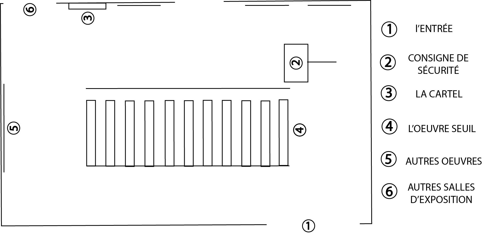

# Exposition Seuil de Michel de Broin

**Lieu :** Arsenal Art Contemporain
**Type :** Exposition temporaire intérieure  
**Date de visite :** 20 février 2026  

---

## L'œuvre *Seuil*  
L'œuvre est une installation contemplative et interactive réalisée en 2017 par l'artiste Michel de Broin.
Elle est construite à partir d’anciennes portes de métro issues de l’Expo 67 et de détecteurs de mouvement. L’artiste y combine deux époques en recyclant ces portes du passé tout en les intégrant à la technologie moderne des détecteurs.

Le spectateur s’immerge dans l’œuvre et se laisse guider par l’enchaînement des portes : en avançant pas à pas, il déclenche l’ouverture successive de chacune. Cette expérience évoque un lieu en constante évolution, où chaque geste entraîne un changement.

---

## Mise en espace

> Le croquis de la salle d'exposition de l'installation Seuil.
> Liens vers les images des différentes vues en bas de page

---

## Composantes et techniques

> 

> 

- 11 Portes de voitures de metro
- Boîtier électrique de contrôle por chaque porte
- Mécanismes d’ouverture des portes
- Rails supérieurs et structures de support pour les portes
- Éclairage en haut des portes
- Composants interactifs liés aux détecteurs de mouvement

## Éléments nécessaires à la mise en exposition
- Salle d’exposition
- Câblage et protecteurs de câbles
- Frein d’urgence pour l’arrêt rapide de l’installation
- Panneau de consignes et sécurité
- 2 Cartels explicatifs

---

## Expérience vécue
1.

---

## Réflexion
**Ce qui m’a plu / idées inspirantes :**  
- 

**Aspect(s) que je ne souhaite pas retenir / ferais autrement :**  
- 

---

## Références

**Hyperliens**  
- [Site d'exposition et billetterie](https://www.arsenalcontemporary.com/mtl/fr/exhib/detail/seuils-micheldebroin)
- [Pour plus d'information sur Michel de broin et ses oeuvres](https://micheldebroin.org/fr/)

**Cartel**  
- [Cartel en francais](media/cartel_francais.jpg)
- [Cartel en anglais](media/cartel_anglais.jpg)

**Composants de l'oeuvre**  
- [Boîtier électrique de contrôle](boitier_electrique_controle.jpg)
- [Éclairage des portes](eclairage_porte.jpg)
- [Mécanique d'ouverture des portes](mecanique_ouverture_porte.jpg)
- [Rails supérieurs](rail_superieur.jpg)

**Éléments nécessaires à la mise en exposition**  
- [Frein d'urgence](frein_urgence_securite.jpg)
- [Panneau de consignes de sécurité](panneau_consigne_sécurité.jpg)
- [Protecteur de câbles](protecteur_cable.jpg)

**Différentes vues de l'installation**
- [Vue de la salle](vue_ensemble_piece.jpg)
- [Vue frontale](vue_frontale.jpg)
- [Vue arrière droite](vue_arriere_droite.jpg)
- [Vue arrière gauche](vue_arriere_gauche.jpg)

Texte écris et images prises par Mariam Elayyan dans le cadre du cour d'oeuvres et de diaspositifs multimédias à Montmorency.
