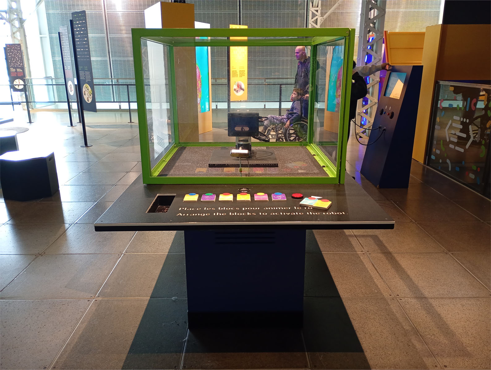

# Exposition Explore - La science en grand

**Lieu :** Centre des sciences de montréal
**Type :** Exposition permanente intérieure  
**Date de visite :** 1 avril 2026  

> L'entrée du lieu d'exposition
---

## L'installation d'un robot meca 500  

 installation interactive réalisée en  par .

> Vue d'ensemble de l'installation

---

## Mise en espace

> Le croquis de la salle d'exposition de l'installation Seuil.

---

## Composantes et techniques
- 

> 

## Éléments nécessaires à la mise en exposition
- Salle d’exposition
- 

> 

---

## Expérience vécue

1. Explorer la pièce
2. 
3. Prendre des photos et vidéo(s) 
4. Réfléchir

---

## Réflexion
**Ce qui m’a plu / idées inspirantes :**  
- 

**Aspect(s) que je ne souhaite pas retenir / ferais autrement :**  
- 

---

## Références

**Hyperliens**  
- [Site d'exposition et billetterie](https://www.arsenalcontemporary.com/mtl/fr/exhib/detail/seuils-micheldebroin)
- [Pour plus d'information sur Michel de broin et ses oeuvres](https://micheldebroin.org/fr/)

**Composants de l'oeuvre**  
- 
- 
- 
- 

**Éléments nécessaires à la mise en exposition**  
- 
- 
- 

Texte écris et images prises par Mariam Elayyan dans le cadre du cour d'oeuvres et de dispositifs multimédias à Montmorency.
