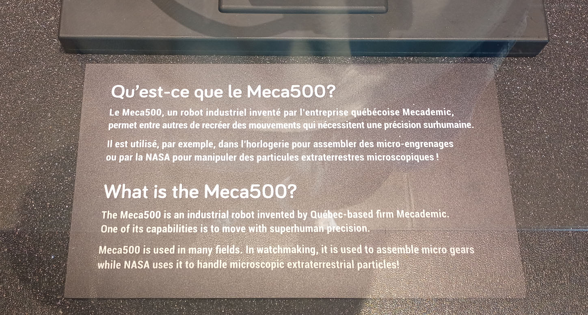

# Exposition Explore - La science en grand

**Lieu :** Centre des sciences de montréal  
**Type :** Exposition permanente intérieure  
**Date de visite :** 1 avril 2026  

> L'entrée du lieu d'exposition
> Source de l'image : [source de l'image de l'entrée de Centre des sciences](https://monde.ccdmd.qc.ca/ressource/?id=30173&demande=desc)
---

## L'installation d'un robot Meca500  

Cette installation interactive est une reproduction du robot industriel Meca500, inventé par une entreprise québécoise nommée Mecademic. Ce robot exécute avec précision les tâches qu’on lui demande.

Le système est composé de blocs illustrant chacun une action que l’on souhaite voir le robot réaliser, comme danser, faire un clin d’œil, et d’autres actions. À l’aide d’une caméra, le robot peut détecter les blocs placés devant lui, les reconnaître, puis exécuter les actions correspondantes après avoir appuyé sur un bouton situé à côté des blocs.

> Vue d'ensemble de l'installation

---

## Mise en espace

> Le croquis d'une partie de la salle d'exposition

---

## Composantes et techniques
- Le robot
- 8 blocs d'instructions
- 2 microphones
- un bouton rouge
- une caméra

> La camera detectant ce qui est illustré sur les blocs  

    

> Les blocs d'instructions  

    
## Éléments nécessaires à la mise en exposition
- Salle d’exposition
- Le socle d’exposition
- Les vitres de protection autour du robot
- La fiche informative
- Instructions sur la table d'exposition et sur le sol pour inviter à faire dancer le robot
  

> La fiche informative sur le Meca500

---

## Expérience vécue

1. Lire l’invitation sur le sol pour faire danser le robot.
2. Placer les blocs dans l’ordre souhaité et appuyer sur le bouton rouge comme indiqué.
3. Prendre des photos et des vidéos du robot en train de danser.
4. S’amuser à observer le résultat et ajuster les blocs pour modifier la chorégraphie.

---

## Réflexion
**Ce qui m’a plu / idées inspirantes :**  
- Permettre aux enfants d’apprendre davantage sur la programmation des robots tout en s’amusant.t
- L’idée de transformer des blocs en mouvements réels du robot.

**Aspect(s) que je ne souhaite pas retenir / ferais autrement :**  
- Le robot n’exécutait parfois pas correctement les actions lorsque les couleurs des blocs s’étaient effacées, rendant l’image moins nette.

---

## Références

**Hyperliens**  
- [Site d'exposition et billetterie](https://www.centredessciencesdemontreal.com/exposition-permanente/explore)
- [Fiche informative sur le Meca500](fiche_informative.jpg)

Texte écris et images prises par Mariam Elayyan dans le cadre du cour d'oeuvres et de dispositifs multimédias à Montmorency.
