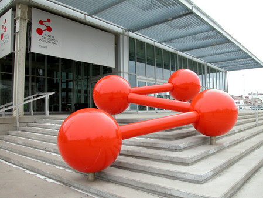
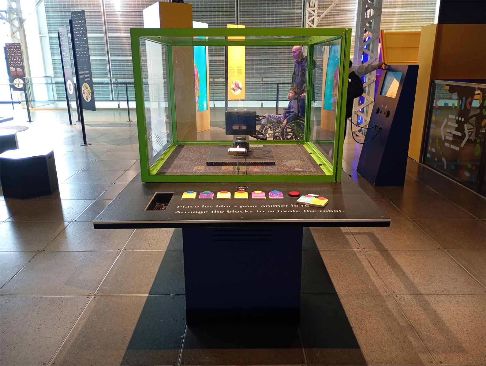
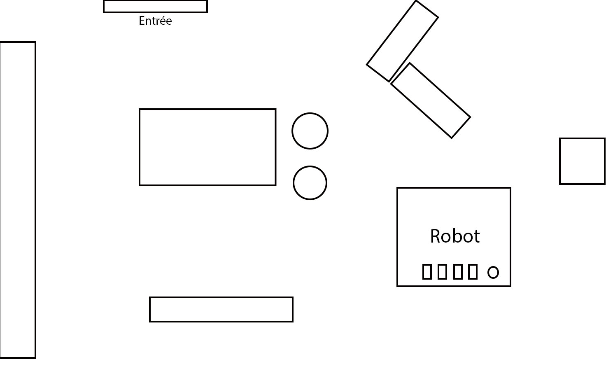
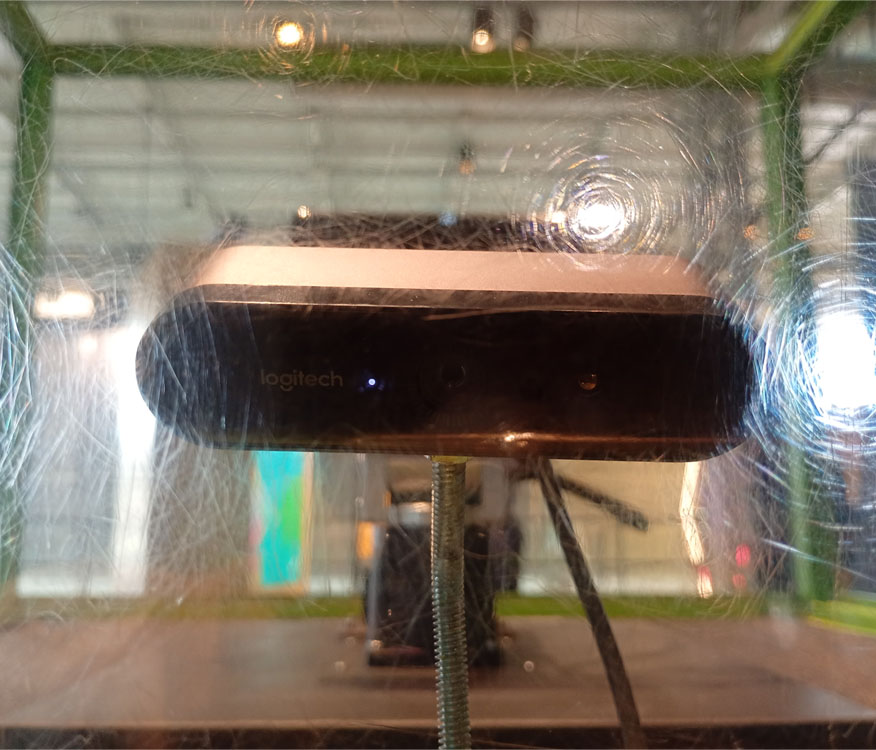
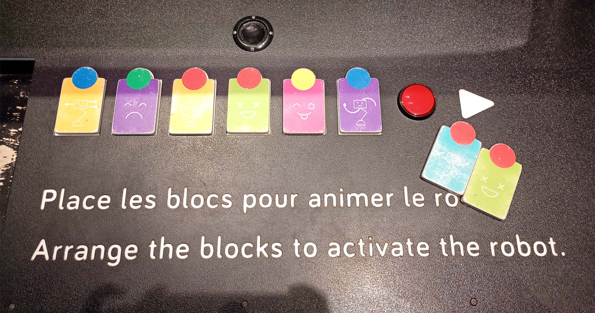

# Exposition Explore - La science en grand

**Lieu :** Centre des sciences de montréal  
**Type :** Exposition permanente intérieure  
**Date de visite :** 1 avril 2026  

> L'entrée du lieu d'exposition
> Source de l'image : [source de l'image de l'entrée de Centre des sciences](https://monde.ccdmd.qc.ca/ressource/?id=30173&demande=desc)
---

## L'installation d'un robot meca500  

L’installation est une reproduction du robot industriel Meca500, inventé par une entreprise québécoise nommée Mecademic. Ce robot exécute avec précision les tâches qu’on lui demande.

Le système est composé de blocs illustrant chacun une action que l’on souhaite voir le robot réaliser, comme danser, faire un clin d’œil, et d’autres actions. À l’aide d’une caméra, le robot peut détecter les blocs placés devant lui, les reconnaître, puis exécuter les actions correspondantes après avoir appuyé sur un bouton situé à côté des blocs.

> Vue d'ensemble de l'installation

---

## Mise en espace

> Le croquis d'une partie de la salle d'exposition

---

## Composantes et techniques
- Le robot
- 8 blocs d'instructions
- 2 microphones
- une caméra

> La camera detectant ce qui est illustré sur les blocs

> La camera detectant ce qui est illustré sur les blocs

## Éléments nécessaires à la mise en exposition
- Salle d’exposition
- Le socle d’exposition
- Les vitres de protection autour du robot
- La fiche informative
- Instructions sur la table d'exposition et sur le sol pour inviter à faire dancer le robot
  

> 

---

## Expérience vécue

1. Explorer la pièce
2. 
3. Prendre des photos et vidéo(s) 
4. Réfléchir

---

## Réflexion
**Ce qui m’a plu / idées inspirantes :**  
- 

**Aspect(s) que je ne souhaite pas retenir / ferais autrement :**  
- 

---

## Références

**Hyperliens**  
- [Site d'exposition et billetterie](https://www.arsenalcontemporary.com/mtl/fr/exhib/detail/seuils-micheldebroin)
- [Pour plus d'information sur Michel de broin et ses oeuvres](https://micheldebroin.org/fr/)

**Composants de l'oeuvre**  
- 
- 
- 
- 

**Éléments nécessaires à la mise en exposition**  
- 
- 
- 

Texte écris et images prises par Mariam Elayyan dans le cadre du cour d'oeuvres et de dispositifs multimédias à Montmorency.
