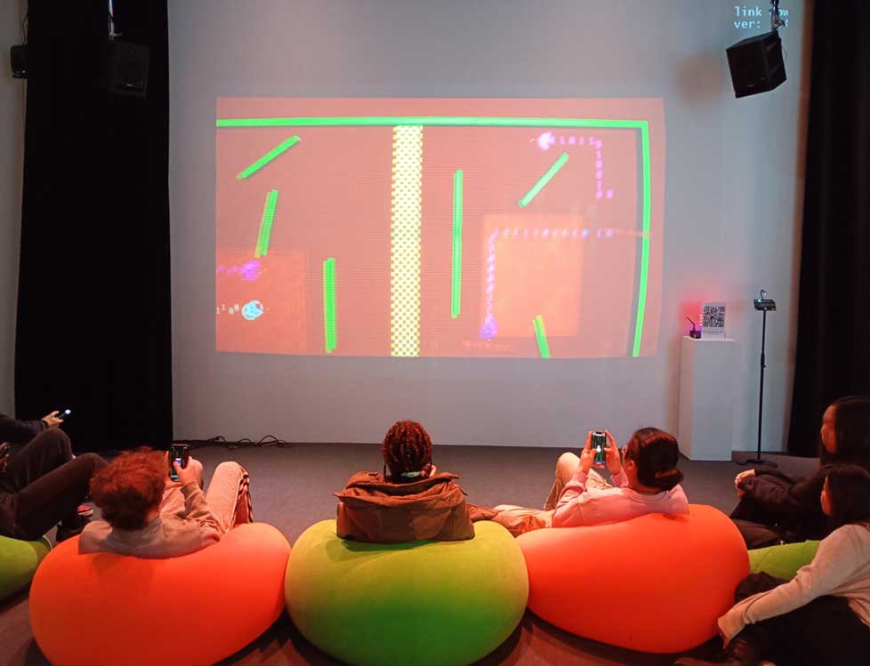
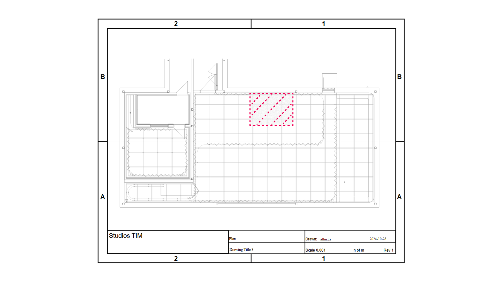
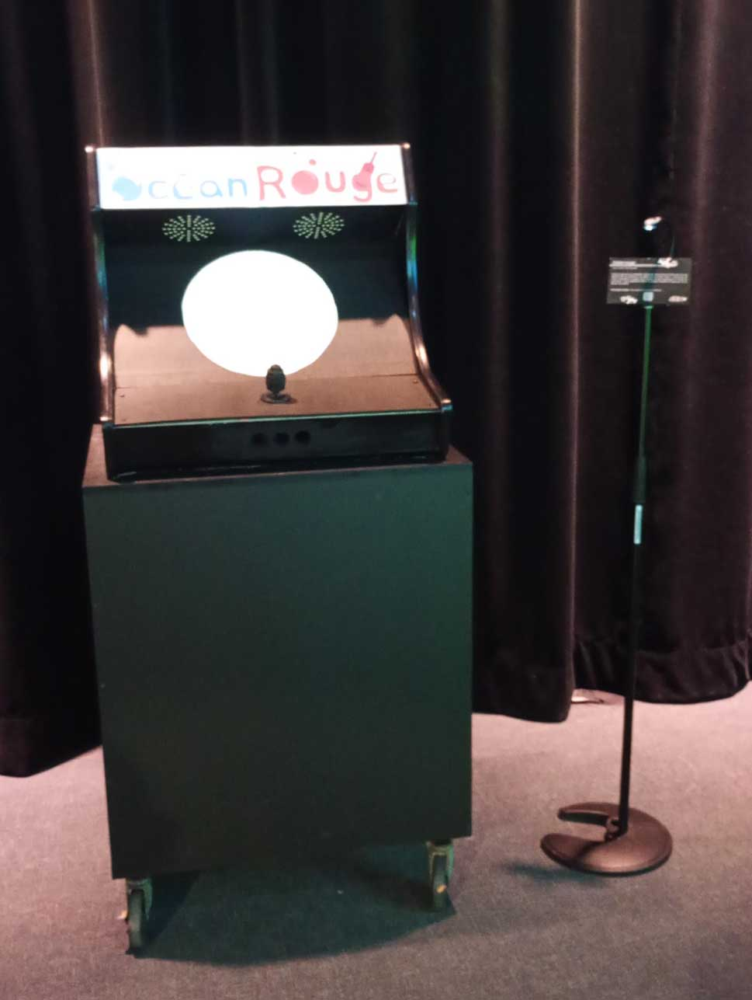
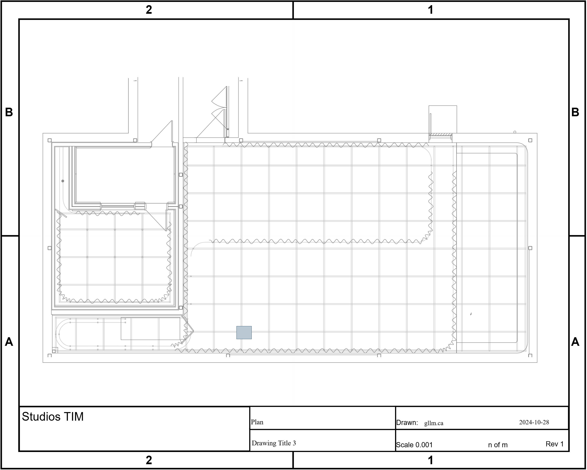
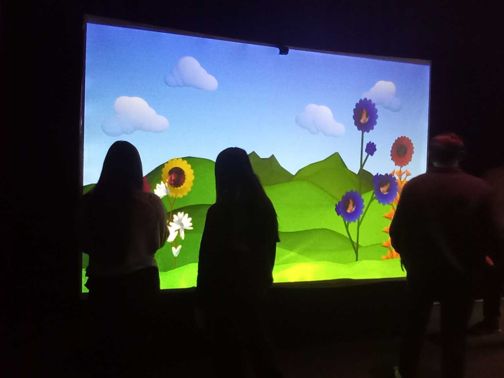
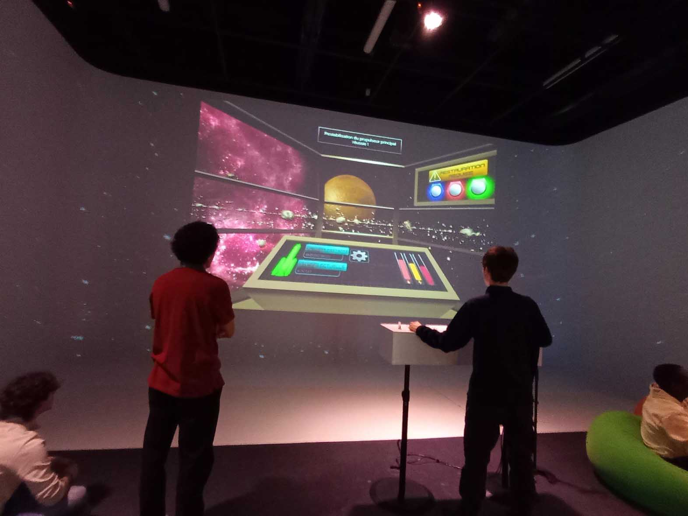
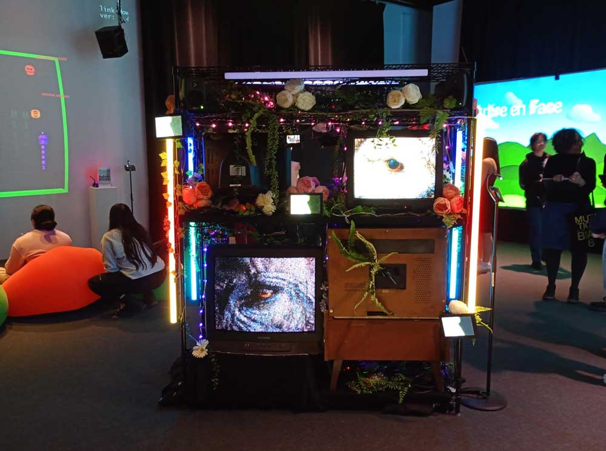

## 1-Terminal

  

>Image de l'ensemble de l'installation.

L'équipe de réalisation: Mégane Ranger, Dana Saavedra-Torrano, Émeryk Bélisle, Elie Daher, Ting Yung Lu Terry.

>Croquis de mise en espace. Schéma de l'installation prévue	schéma de mise en espace (plantation ou implantation)	télécharger le dessin à partir de la documentation GitHub de l'équipe, et indiquer la source dans la légende et le nom du fichier

### Réflexion
Ce que vous ressentez en expérimentant chacune des installations, avec justification (avant ou après l'expérimentation)	

## 2-Ocean rouge

  

>Image de l'ensemble de l'installation.

L'équipe de réalisation: Kristy Moussally,Amira Tounekti.

>Croquis de mise en espace.

### Réflexion

## 3-Arbre en face

  

>Image de l'ensemble de l'installation.

L'équipe de réalisation: Matis Ghariani, Rafael Angon Dube, Mathieu Willett, Alexandre Gendron, Mikael Arseneau.

>Croquis de mise en espace.

### Réflexion

## 4-Mission Décollage

  

>Image de l'ensemble de l'installation.

L'équipe de réalisation: Ahmed Kaissoumi, Radhouane Kordan, Justin Montpetit, Thearylou Lach, Jad Saloumi.

>Croquis de mise en espace.

### Réflexion

## 5-Quand les yeux se croisent

  

>Image de l'ensemble de l'installation.

L'équipe de réalisation: Manel Yaya, Patricia Nassif, Edelwyn Ledru, Félix Lavoie, Jade Hébert.

>Croquis de mise en espace.

### Réflexion
