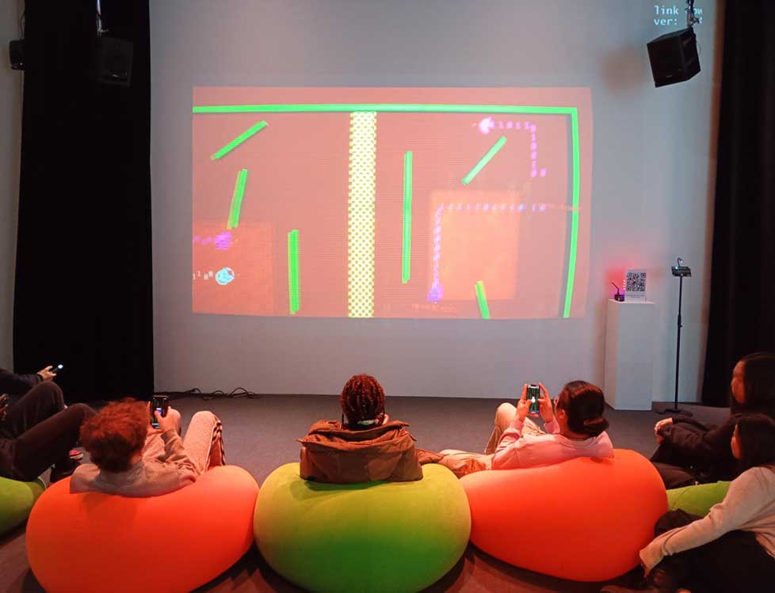
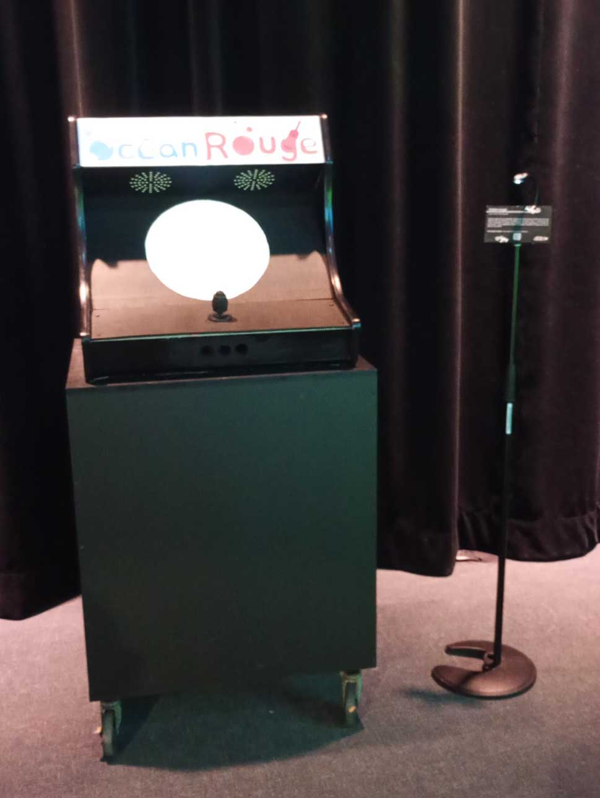
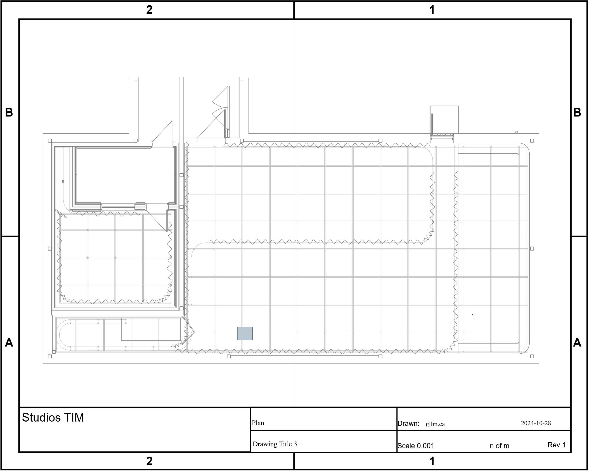
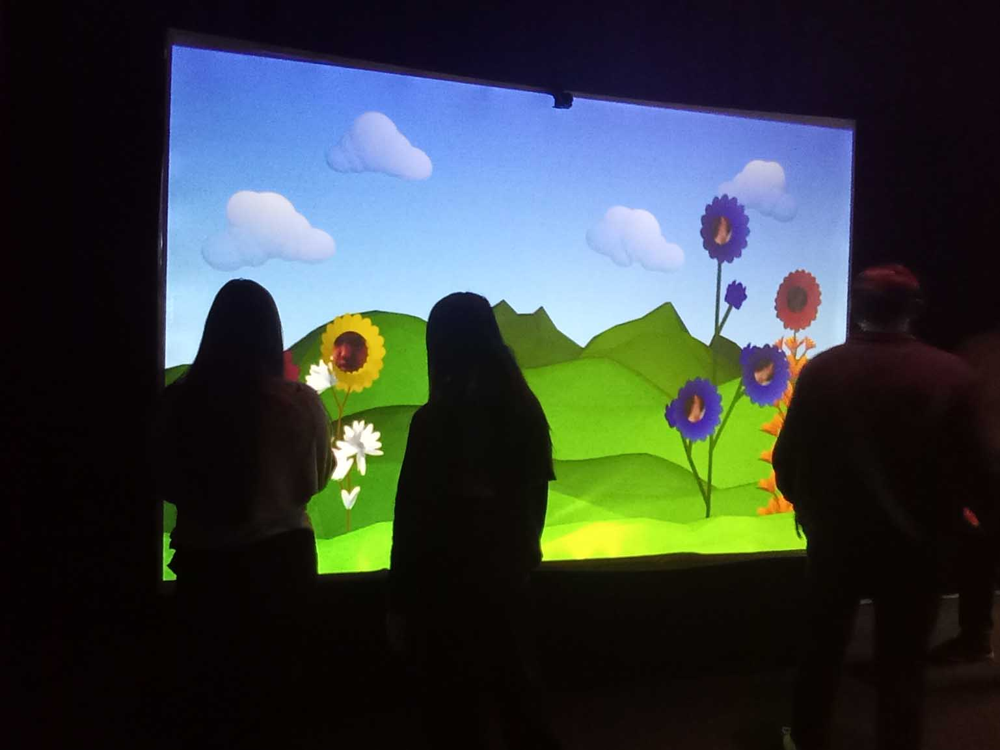
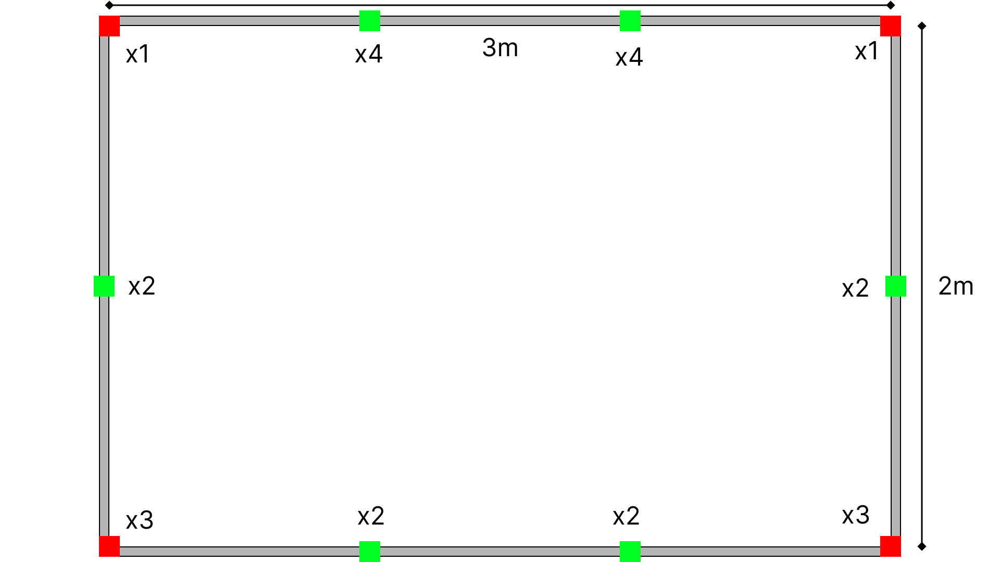
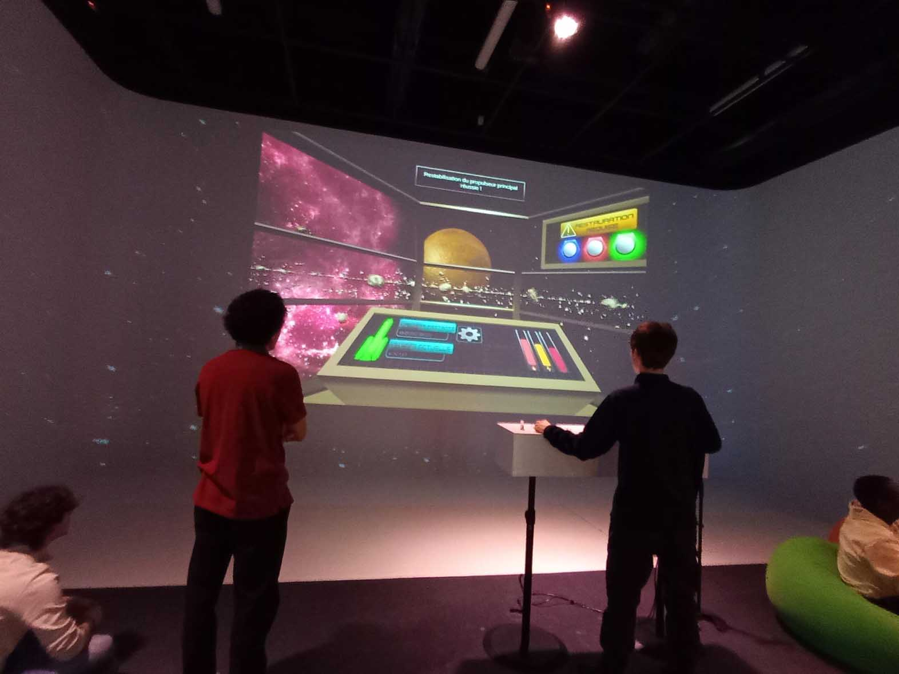
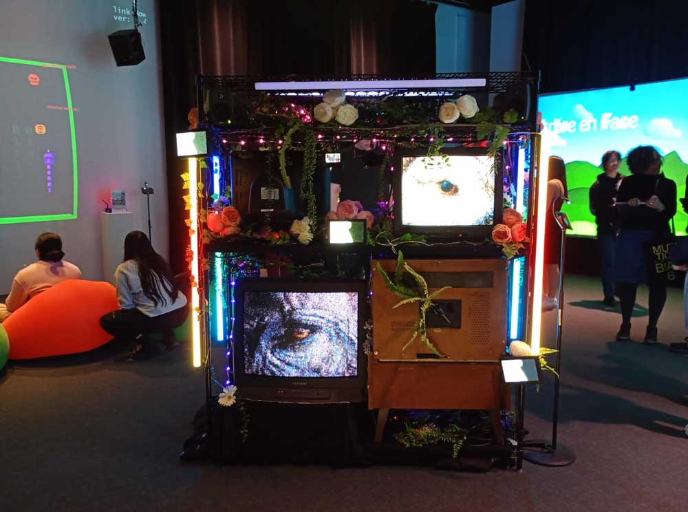

# Projets Finissants
## 1-Terminal

  

>Image de l'ensemble de l'installation.

L'équipe de réalisation: Mégane Ranger, Dana Saavedra-Torrano, Émeryk Bélisle, Elie Daher, Ting Yung Lu Terry.

>Croquis de mise en espace. Schéma de l'installation prévue	schéma de mise en espace (plantation ou implantation)	télécharger le dessin à partir de la documentation GitHub de l'équipe, et indiquer la source dans la légende et le nom du fichier
>[Source de l'image](https://pythons-5.github.io/Terminal/#/technique/)

### Réflexion
C’était amusant de jouer en groupe, car tout le monde participait ensemble. Par contre, on perdait parfois à cause d’une seule personne, ce qui pouvait être frustrant.
  
## 2-Ocean rouge

  

>Image de l'ensemble de l'installation.

L'équipe de réalisation: Kristy Moussally,Amira Tounekti.

>Croquis de mise en espace.
>[Source de l'image](https://deux-intelligence.github.io/deux-neurones/#/technique/)

### Réflexion
J’ai aimé le style arcade et l’idée du jeu. Par contre, après un certain temps, ça devient répétitif et un peu ennuyant.
  
## 3-Arbre en face

  

>Image de l'ensemble de l'installation.

L'équipe de réalisation: Matis Ghariani, Rafael Angon Dube, Mathieu Willett, Alexandre Gendron, Mikael Arseneau.

>Croquis de mise en espace.
>[Source de l'image](https://mammouths.github.io/projet/#/technique/)

### Réflexion
Je trouve intéressant la façon dont la caméra détecte avec précision notre visage dès notre arrivée dans la salle et l’intègre dans une fleur, même lorsque nous sommes en mouvement et sans que nous réalisions que nous sommes filmés.  
  
## 4-Mission Décollage

  

>Image de l'ensemble de l'installation.

L'équipe de réalisation: Ahmed Kaissoumi, Radhouane Kordan, Justin Montpetit, Thearylou Lach, Jad Saloumi.

>Croquis de mise en espace.
>[Source de l'image](https://o-i-g-n-o-n.github.io/Mission-decollage/#/technique/)

### Réflexion
J’ai trouvé l’installation un peu frustrante, car c’était difficile de comprendre quoi faire et à quoi servaient les actions. 
  
## 5-Quand les yeux se croisent

  

>Image de l'ensemble de l'installation.

L'équipe de réalisation: Manel Yaya, Patricia Nassif, Edelwyn Ledru, Félix Lavoie, Jade Hébert.

>Croquis de mise en espace.
>[Source de l'image](https://emersiaa.github.io/Quand-les-yeux-se-croisent/#/technique/)

### Réflexion
Personnellement, je n’ai pas trouvé l’installation très engageante, car elle ne donnait pas envie d’y passer beaucoup de temps.

## Cours incontournables pour réaliser ces projets
1. Traitement audiovisuelle, car il permet d’apprendre à capter, modifier et diffuser du son et de la vidéo, ce qui est essentiel pour créer des installations interactives.
2. Interactivité ludique, car elle aide à concevoir des systèmes interactifs où l’utilisateur peut agir et observer des réactions en temps réel, souvent sous forme de jeu, ce qui correspond à plusieurs des installations présentées.
3. Réalité mixte, car il permet de créer des environnements immersifs en combinant des éléments réels et virtuels de manière interactive comme dans l'installation quand les yeux se croisent.

## Une composante que je ne connaissais pas
### TouchDesigner
  
  
La société canadienne Derivative a développé ce logiciel de création de contenu multimédia interactif. Fondé sur des nœuds, il utilise un langage de programmation visuel permettant de manipuler des objets 2D et 3D en temps réel. TouchDesigner est très connu pour être utilisé dans la création de performances, d’installations et d’œuvres multimédias.
