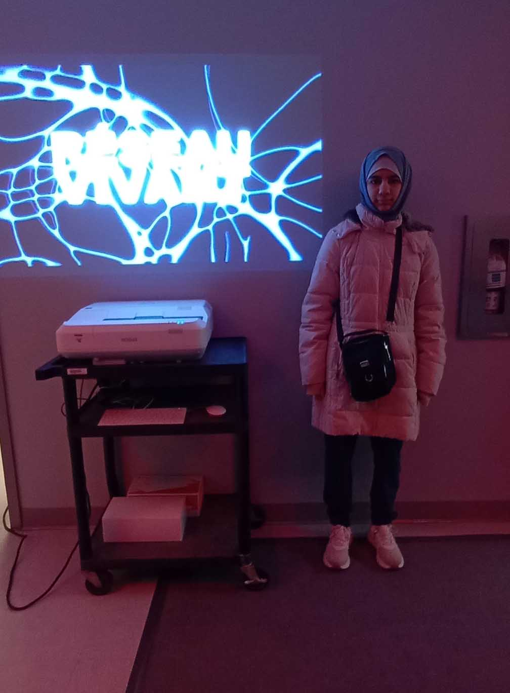
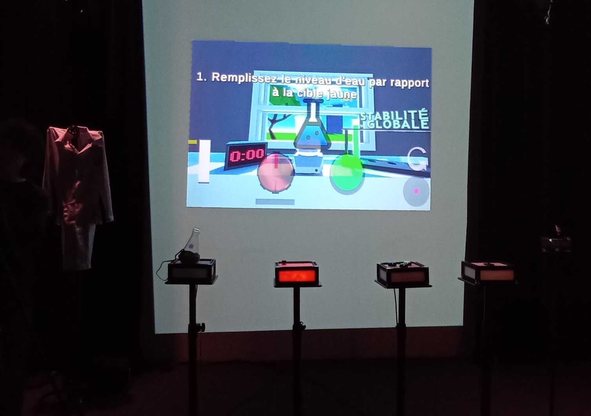
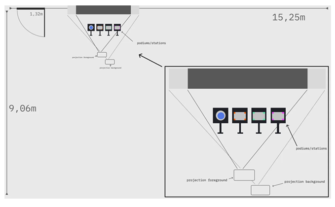

# Jeu vidéo Symbiose

**Lieu :** Grand studio au Collège Montmorency  
**Type :** Exposition temporaire intérieure  
**Date de visite :** mardi mars 2026  

> L'entrée du lieu d'exposition, grand studio

---

## *Symbiose*  

L’installation interactive a été réalisée en 2026 par Yannick Chamberland, Benjamin Ferland, Ryan Dufault et Walid Cheour. C’est un jeu de collaboration qui se joue à quatre. Chaque joueur a une tâche et une station de contrôle différente (eau, flamme, poudres et tourbillon). Pour empêcher la potion d’exploser, les joueurs exécutent les manipulations indiquées à l’écran, propres à leur station, afin de la maintenir stable le plus longtemps possible. Au cours du jeu, divers événements surviennent. Chacun est associé à une station spécifique parmi les quatre et perturbe le flot de la potion, ce qui permet de proposer un défi équitable à chaque joueur.
  

> Vue frontale de l'installation

---

## Mise en espace

> Le croquis de la salle d'exposition de l'installation Seuil.
  
---

## Composantes et techniques
| Catégorie       | Éléments / Détails |
|-----------------|--------------------|
|  Audio  |  2 haut-parleurs actifs de 5", 2 fils XLR conducteurs de 15',  Carte de son multi-sorties + adaptateur powerCON  |
|  Vidéo  |  2 projecteurs Epson PowerLite 990U,  1 câble HDMI  |
|  Lumière  |  1 lumières LED RGBAW DMX (une par station),  1 fils XLR conducteurs de 20',  1 Interface DMX Via XLR,  LEDs i2c pour brûleur  |
|  Électricité  |  4 extensions électriques  |
|  Réseau  |  3 câbles ethernet,  1 transmetteurs et 1 récepteurs (pour projection)  |
|  Ordinateurs  |  1 ordinateur portable (avec cable alimentation)  |
|  Matériaux de fabrication  |  1 planche de plywood 2 par 4 1/4" ; Pour stations feu et poudres et tourbillon lors de maquette #2,  Visserie et quincaillerie,  Tissus bleu semi-transparent pour intérieur erlen meyer  |
|  Capteurs et contrôleurs  |  3 M5Stack ATOM PIOE pour transmission de données ethernet,  2 M5Stack Pbhub pour grouper les units,  6 M5Stack Key Unit,  1 M5Stack Angle Unit,  1 M5Stack ATOMS3,  1 Joystick analogique X-Y, 1 Arduino Nano  |
|  Objets physiques  |  1 Erlenmeyer 500ml,  1 Knob de 30mm avec shaft de 6mm (pour fixer sur angle unit),  3 Boutons style arcade 60mm (station poudres) (vert bleu blanc)  |

### Logiciels Requis:   
**Environnement de programmation**:  Visual Studio Code / PlatformIO / Arduino IDE (Programmation des capteurs: accéléromètre, knobs, joystick),  Unity 3D (Scène globale, réception données).  
  
**Design graphique / Effets visuels**:  After Effects (Effets de particules pré-rendus au besoin),  Photoshop (Textures pour le laboratoire 3D),  Blender/Maya (Modélisation 3D),  TouchDesigner (Arrière plan de la seconde projection),  Gestion de l'éclairage,  QLC+ (Éclairage).   
  
**Audio**:  Reaper / FL Studio (Composition et design sonore),  Synthétiseurs VST (Sons de laboratoire, événements).   

> 

## Éléments nécessaires à la mise en exposition
- 4 projecteurs
- Cartel explicatif

> 

---

## Expérience vécue

1. Prendre connaissance de l'objective de jeu et la fonction de chaque joueur.
2. Jouer en équipe et essayer de battre le record de temps.
3. Prendre des photos et vidéo(s).
4. Réfléchir à l’expérience vécue et aux sensations ressenties.

---

## Réflexion
**Ce qui m’a plu / idées inspirantes :**  
- Le concept du jeu est simple, mais trés bien exécuté.
- J’ai aimé l’aspect collaboratif du jeu, où chaque joueur exerce une influence claire sur son déroulement.

**Aspect(s) que je ne souhaite pas retenir / ferais autrement :**  
- Certains rôles peuvent sembler moins engageants que d’autres.
- On peut trouver la dépendance entre les joueurs frustrante si l’un d’eux fait des erreurs fréquentes.

---

## Références

**Hyperliens**  
- [Pour plus d'information sur l'installation](https://les-chimistes.github.io/symbiose/#/)

**Cartel**  
- [Cartel](media/)

**Composants de l'oeuvre**  
- 
- 
- 
- 

**Éléments nécessaires à la mise en exposition**  
- 
- 
- 

Texte écris et images prises par Mariam Elayyan dans le cadre du cour d'oeuvres et de dispositifs multimédias à Montmorency.

