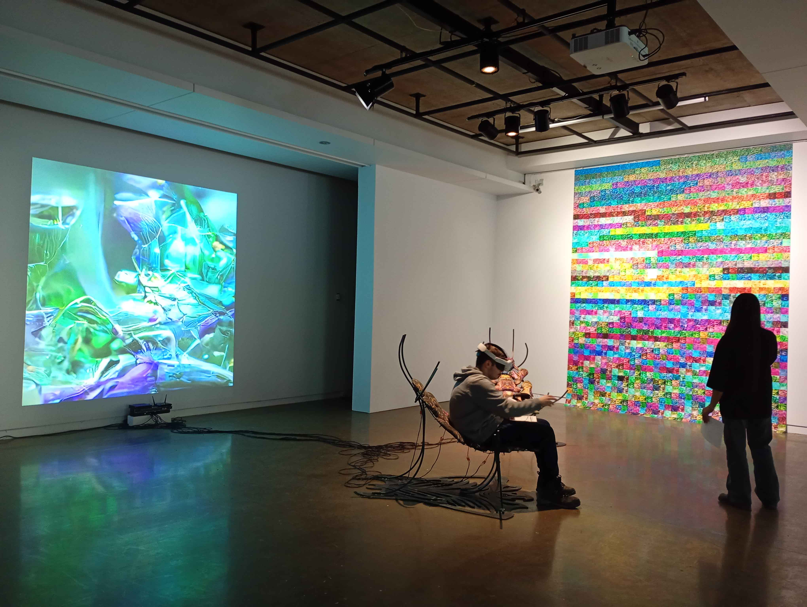

# Devenir partages, pratiques de l'IA

**Lieu :** Galerie de l'Université de Montréal  
**Type :** Exposition temporaire intérieure  
**Date de visite :** 29 janvier 2026  

---

## L'œuvre *Techno-Compost*  
L'œuvre est une installation contemplative et immersive réalisée en 2025 par l'artiste Marie-Ève Levasseur.  
Des milliers de déchets numériques sont produits par les images générées par les IA. C’est de cette idée que Levasseur part : **recycler ces images pour en créer de nouvelles sous d’autres formes**.

À l’instar d’un compost, les images numériques ne disparaissent pas réellement, mais se désintègrent et se fragmentent, se transformant en **bruit visuel**, semblable à celui produit par les anciens téléviseurs. Ces bruits visuels aléatoires sont ensuite utilisés pour reconstruire de nouvelles images.

C’est dans un **espace latent**, comparable à un jardin, que les images « poussent », passant d’idées et de possibilités, se mélangeant et se transformant jusqu’à former l’image finale. Cette pratique invite à imaginer un univers numérique **plus lent, attentif et productif**, contrairement à la surproduction numérique habituelle.

---

## Mise en espace

| Emplacement | Contenu |
|-------------|---------|
| Mur gauche  | Projection d’exemples de résultats du processus |
| Mur droit   | Mosaïque d’images montrant des échantillons du processus: certaines proches du bruit visuel, d’autres plus structurées |
| Centre      | Expérience interactive en réalité virtuelle (interactions avec les images) |

---

## Composantes et techniques
| Catégorie       | Éléments / Détails |
|-----------------|------------------|
| **Composantes** | Image projecté, mur d’images, installation immersive (chaise/structure), casque RV, expérience immersive du spectateur |
| **Techniques**  | Génération IA, projection , impression numérique, RV, installation multimédia, accumulation/collage visuel, dispositif interactif |
| **Matériaux**   | Écrans, projecteurs, ordinateurs, casque VR et capteurs, câbles et haut-parleurs, modem, transducteur, mousse de rembourrage, structure en acier |

**Logiciels utilisés :**  
Unity, Blender, GIMP, Materialize, Reaper, Max MSP, Mosaïque, Flu Coma, …

## Éléments nécessaires à la mise en exposition
- Salle d’exposition
- Murs blancs
- Éclairage au plafond
- Prises électriques
- Cartels explicatifs
- Structure pour surélever le modem

---

## Expérience vécue
1. Le médiateur de l’exposition présente et explique chaque élément de chaque œuvre
2. Le visiteur fait le tour de chaque œuvre et prend des photos
3. Le visiteur expérimente les dispositifs immersifs proposés

---

## Réflexion
**Ce qui m’a plu / idées inspirantes :**  
- …  

**Aspects que je ne souhaite pas retenir :**  
- …  

---

## Références
- [Biographie des artistes](https://galerie.umontreal.ca/devenirs-partagees-pratiques-de-lia.php)<

**Cartel**  
- [Description de l'oeuvre](media/cartel.jpg)]
- [Collaborateurs](media/cartel_collaborateur.jpg)
- [Matériels](media/cartel_materiel.jpg)

**Composants de l'oeuvre**  
  

