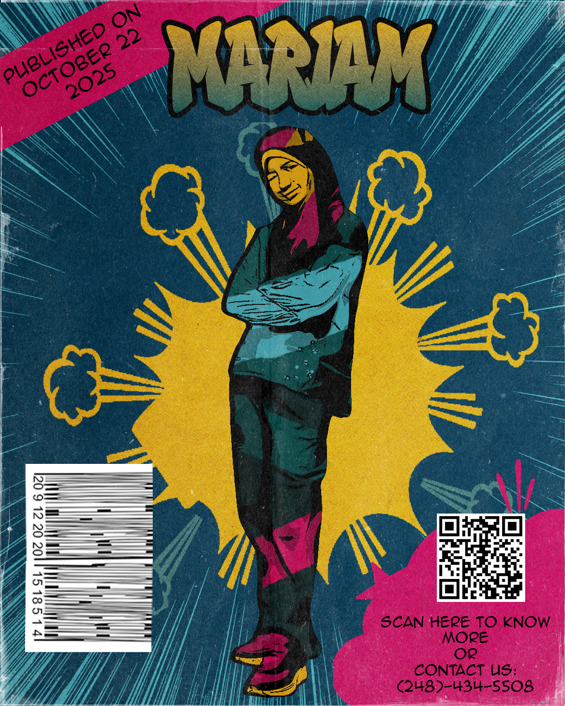

# Mariam Elayyan

>Moi transformé en bande dessiné.

# Intéret dans le multimédia
J’apprécie particulièrement l’animation 2D et la manière dont elle permet de créer des univers immersifs. Je trouve fascinant que des personnages fictifs puissent transmettre des émotions aussi fortes. Je préfère les œuvres qui impliquent activement le public, comme Gravity Falls, qui regorge de messages cachés et propose des énigmes à la fin de chaque épisode. La chasse au trésor qu’ils ont menée était une idée brillante.

À consulter ici:
<https://maydaygirl-save-our-ships.tumblr.com/post/148405763413/cipher-hunt-complete-summary>
