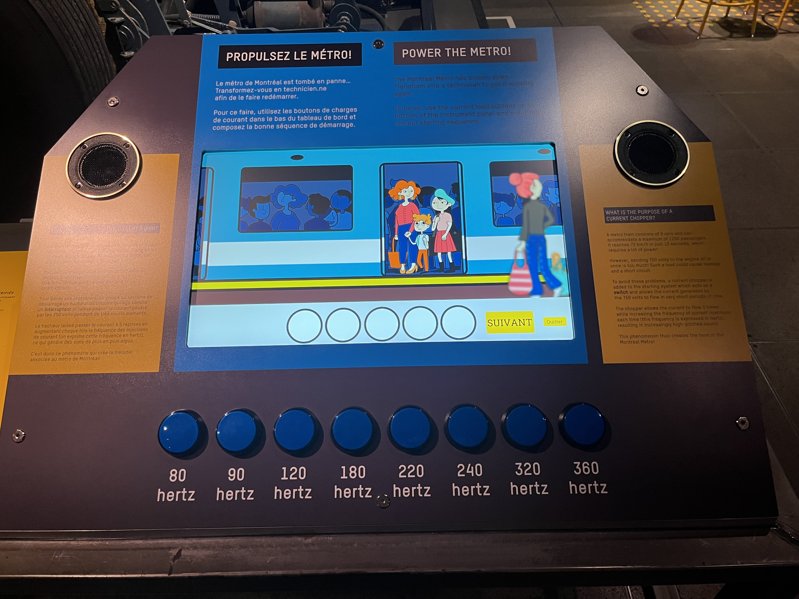

# Compte-rendu de la conférence de Martin Boucher

Martin Boucher, technicien multimédia au Musée de l’ingéniosité J. Armand Bombardier, a présenté son travail ainsi que la création et le fonctionnement de dispositifs multimédias dans l’exposition permanente du musée situé à Valcourt.  
  
Au début, il a présenté les différentes tâches liées à son travail. Il a expliqué qu’il intervient en informatique (conversion de fichiers, programmation, production audiovisuelle), en électricité, en audio, en éclairage et en gestion de projet. Il a ensuite présenté des exemples de dispositifs. Il a fait le tour de ce qui était dans le garage de Bombardier, la mise en espace du lieu et le fonctionnement de certains éléments dans le magasin de pièces et autres. Il a accompagné sa présentation de croquis pour illustrer l’organisation technique, comme le placement des sons et des projections afin de créer une expérience plus immersive.  
Il a aussi présenté le bogie de métro. Comme cet élément attirait peu l’attention des visiteurs, un dispositif interactif a été ajouté. Celui-ci consiste en un jeu où l’utilisateur reproduit une mélodie associée au métro à l’aide de boutons produisant différents sons.   
 
> Jeu où il faut reproduire la mélodie du métro à l’aide de boutons produisant différentes fréquences de sons.  
> Image capturée par l’enseignante d’œuvres et dispositifs multimédias, Sylvie François.
Enfin, il a également présenté certains outils utilisés dans le domaine, comme Arduino et Raspberry Pi, ainsi que des logiciels tels que Blender, DaVinci Resolve, OBS Studio et Bitwig Studio.  
  
Cette conférence était intéressante, surtout pour les exemples concrets de dispositifs et pour mieux comprendre le travail de technicien multimédia.
